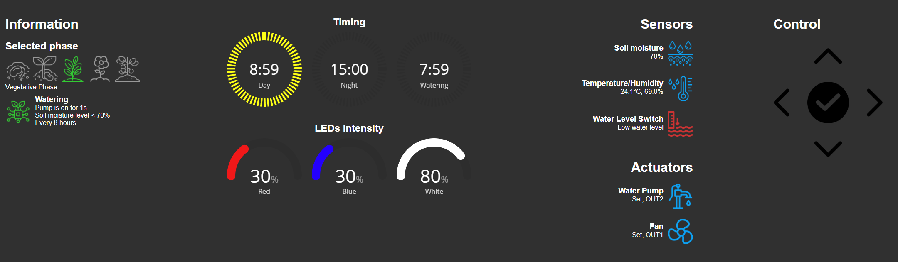

# Albilab Remote Control

This project enables control and operation of the Albilab station over the internet. All sensitive information typically returned by the Albilab API has been removed, and security is implemented via basic authentication.





## Getting Started

### Prerequisites

- **ESP8266**: You will need an ESP8266 microcontroller to act as the remote control.
- **Wi-Fi Network**: Ensure you have access to a Wi-Fi network for the ESP8266 to connect to.
- **Docker**: The Flask application can be run using Docker.

### ESP8266 Setup

1. **Edit the `ESP8266/albilab_remote_esp.ino` file**:
   - Set the `ssid` and `password` variables to your Wi-Fi network's name and password.

   ```cpp
   const char* ssid     = "YOUR_WIFI_SSID";   // The SSID (name) of the Wi-Fi network you want to connect to
   const char* password = "YOUR_WIFI_PASSWORD"; // The password of the Wi-Fi network
   ```

2. **Upload the code to the ESP8266**:
   - Use the Arduino IDE or another compatible tool to upload the `ESP8266/albilab_remote_esp.ino` file to your ESP8266 device.

### Flask Application Setup

1. **Edit the `albilab.py` file**:
   - Set the following constants in the source code:

     ```python
     # Define the remote server address
     remote_server = 'ADD_REMOTE_SERVER_HERE'

     # Define the API URL for Albilab
     ALBILAB_INFO_API_URL = 'http://ADD_ALBILAB_LOCAL_ADDRESS_HERE/info'

     # Define user credentials
     users = {
         "albilab": "ADD_PASSWORD_HERE"
     }
     ```

2. **Build and Run the Docker Container**:
   - Build the Docker image:

     ```bash
     docker build -t albilab-remote-control .
     ```

   - Run the Docker container:

     ```bash
     docker run -p 5000:5000 albilab-remote-control
     ```

### Usage

- Once the ESP8266 is connected to your Wi-Fi network and the Flask application is running, you can access the web interface to control the Albilab remote pins.

### Notes

- Ensure that the ESP8266 and the machine running the Flask application are on the same network for seamless communication.
- The Flask application uses basic HTTP authentication. Make sure to set a strong password in the `albilab.py` file.

This setup allows you to control the Albilab remotely using a web interface, with the ESP8266 acting as the physical remote control.

