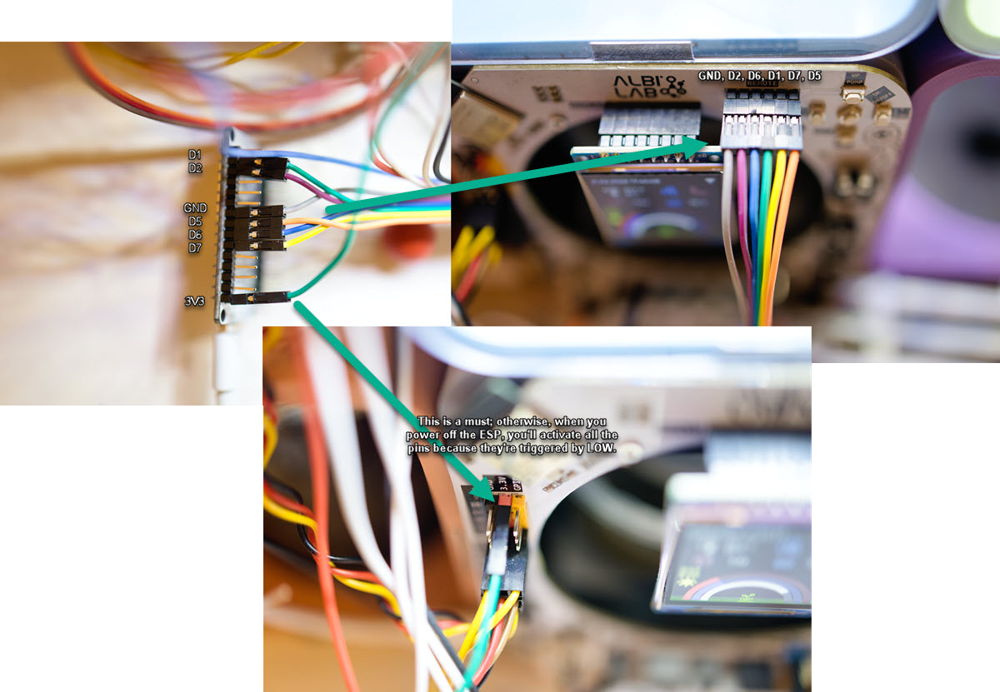

# Albilab Remote Control

This project enables control and operation of the Albilab station over the internet.  
All sensitive information typically returned by the Albilab API has been removed, and security is implemented via basic authentication.

For full remote control, it is necessary to have a remote camera positioned in front of the Albilab.

  



---

## Getting Started

### Prerequisites
- **ESP8266** – for the classic “relay-style” remote control  
- **ESP32 touch board (optional)** – 3-D-printed keypad with five capacitive buttons for direct hardware control (STL link will be added soon)  
- **Wi-Fi Network** – both micro-controllers must be able to join your Wi-Fi  
- **Docker** – to run the Flask web application

---

## ESP8266 Setup (web-trigger variant)

1. **Edit `ESP8266/albilab_remote_esp.ino`**

   ```cpp
   const char* ssid     = "YOUR_WIFI_SSID";
   const char* password = "YOUR_WIFI_PASSWORD";
   ```

2. **Upload the code** to the ESP8266 via Arduino IDE (or PlatformIO).

---

## ESP32 Touch Board Setup (hardware keypad)

The touch board calls the very same Albilab URLs as the web interface, but you press physical buttons instead of clicking on the page.

1. **Edit `ESP32/albilab_touch_board.ino`**

   ```cpp
   const char* ssid     = "YOUR_WIFI_SSID";
   const char* password = "YOUR_WIFI_PASSWORD";

   // ========= MUST be set before first flash =========
   const char* ALBILAB_BASE_URL  = "";     // <- same URL as ESP8266 / Flask
   const char* AUTH_HEADER_NAME  = "Authorization";                    // usually leave as is
   const char* AUTH_HEADER_VALUE = "Basic "; // <- the user:password base64 version token
   // ==================================================
   ```
   All other constants (touch pins, thresholds…) come with sane defaults.

2. **Upload the code** to any ESP32 that supports capacitive pins (the default pin list is `{4, 14, 27, 33, 32}` → `T0–T4`).

3. **Print the enclosure**  
   A 3-D printable model for the five-button keypad will be published here: .  
   Wiring is trivial: just power the ESP32 (5 V → VIN, GND → GND). The capacitive electrodes are part of the printed front plate; no extra components are required.

---

## Flask Application Setup

1. **Edit `albilab.py`**

   ```python
   # where the micro-controller lives (IP or mDNS name)
   remote_server = 'ADD_ESP_SERVER_HERE'

   # Albilab local API endpoint
   ALBILAB_INFO_API_URL = 'http://ADD_ALBILAB_LOCAL_ADDRESS_HERE/info'

   users = {
       "albilab": "ADD_PASSWORD_HERE"
   }
   ```

2. **Build & run the container**

   ```bash
   docker build -t albilab-remote-control .
   docker run -p 5000:5000 albilab-remote-control
   ```

---

## Usage

With the Flask application running, open <http://localhost:5000> (or the host IP) and control the station either:

- via the web interface (ESP8266 receives the command), **or**  
- by touching the buttons on the ESP32 keypad (ESP32 sends the same HTTPS requests directly).

Both paths hit the identical Albilab REST endpoints, so they are completely interchangeable.

---

## Notes

- Keep the ESP-devices and the machine running Flask on the same network (or expose/mDNS accordingly).  
- Basic HTTP authentication is used; choose a strong password in `albilab.py`.  
- Touch sensitivity (`THRESHOLD`) and debounce (`MIN_TIME`) can be tuned in the ESP32 sketch if your printed keypad behaves differently.
